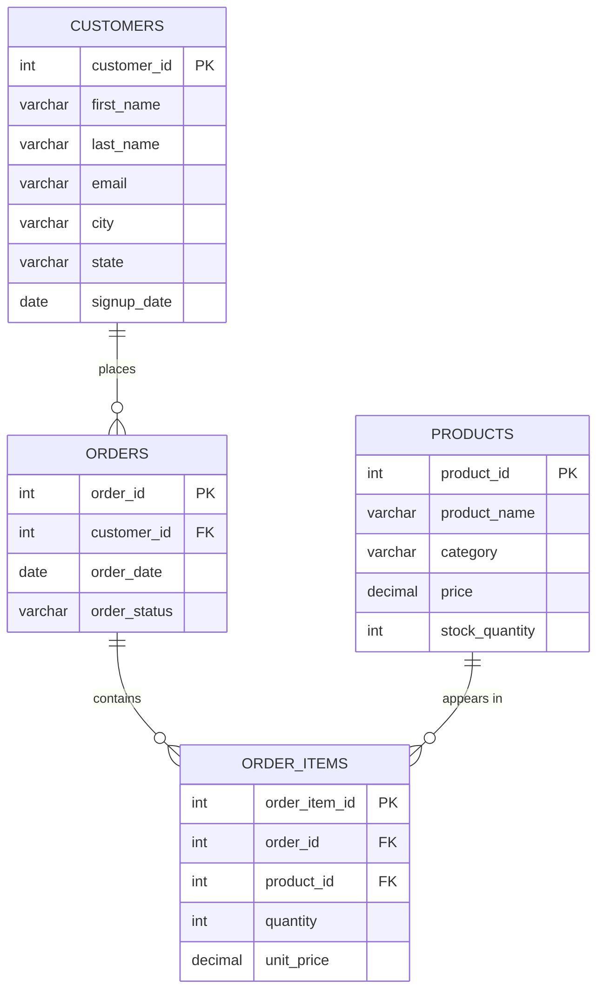

# Entity-Relationship Diagram — Online Retail Sales Database

This diagram uses [Mermaid](https://mermaid.js.org/) syntax, which
renders automatically in GitHub's Markdown preview.

## Relationship Summary

| Relationship                     | Type | Meaning                                              |
|-----------------------------------|------|-------------------------------------------------------|
| `customers` → `orders`            | 1:N  | One customer can place many orders                    |
| `orders` → `order_items`          | 1:N  | One order can contain many product line items          |
| `products` → `order_items`        | 1:N  | One product can appear as a line item in many orders   |

`order_items` is the bridge table that resolves the many-to-many
relationship between `orders` and `products` — this is a standard
pattern in retail/e-commerce data modeling.
